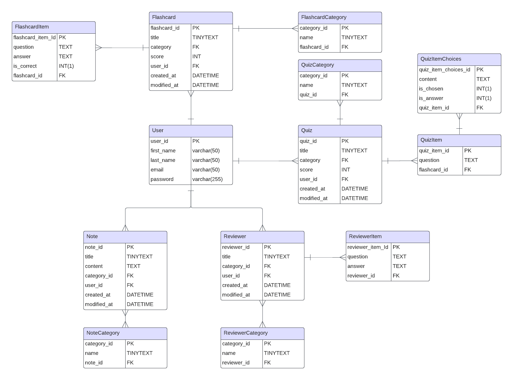

<h2>Table of contents:</h2>
<a href="#INTRO">Introduction</a> 
<a href="#PURPOSE">Purpose</a> 
<a href="#KEYFEATURES">Key features</a> 
<a href="#ERD">Entity Relationship Diagram (ERD):</a> 

<h2 id="INTRO">Introduction:</h2>

  21st century – a modern age powered by interconnected network of wires, an age
  with technologies that can power or harm you. Despite the modernization of
  most industries, we somehow forgot to develop the educational system. The
  inefficiency of our current education system is tolerated, wasting not only
  money, but huge amount of time, and talent. But this doesn’t mean that we
  normal nerds can’t create solutions, and that doesn’t necessarily mean we have
  to fight our current education system. Instead, we could leverage our
  technology by taking advantage of our freedom to use and create our own.

  I believe that in-order to achieve great things you need to use tools
  purposely designed with information acquired from research studies targeted to
  the specific subject, such as learning habits.

  “Learning buddy” is simply a web application designed using the information
  acquired from multiple research studies that has been concluded in the areas
  of maximizing the learning efficiency of the learner.

<h2 id="PURPOSE">Purpose:</h2>

  “Learning buddy” is a project meant to solve the inefficiency of our current
  education system by providing the necessary tools to integrate research-based
  tools to your own workflow.

<h2 id="KEYFEATURES">Key features:</h2>

  Features are divided according to the apps built in the project “Learning
  buddy”. Learn – This app has 3 core functionalities:

<ul>
  <li>Reviews</li>
  <ul>
    <li>Create review</li>
    <li>Update review</li>
    <li>Delete review</li>
    <li>Read review</li>
  </ul>
</ul>
<ul>
  <li>Flashcards</li>
  <ul>
    <li>AI generated flashcards through review</li>
    <li>Create flashcards</li>
    <li>Update flashcards</li>
    <li>Delete flashcards</li>
    <li>Read flashcards</li>
  </ul>
</ul>
<ul>
  <li>Quizzes</li>
  <ul>
    <li>AI generated quiz through reviews</li>
    <li>Create quiz</li>
    <li>Update quiz</li>
    <li>Delete quiz</li>
    <li>Read quiz</li>
  </ul>
</ul>

<ul>
  <li>Analytics – Shows relevant data</li>
  <ul>
    <li>Show Subject Data</li>
    <ul>
      <li>Score Trend</li>
    </ul>

  <li>Show Category Data</li>
    <ul>
      <li>Score Trend</li>
    </ul>

  <li>Show Subcategory Data</li>
    <ul>
      <li>Score Trend</li>
    </ul>

  <li>Show Consistency Data</li>
  </ul>
</ul>

Bonus feature:
<ul>
  <li>Automated emailer – Implements space repetition rule</li>
  <ul>
    <li>Email the user to review every x amount of time</li>
  </ul>
</ul>

The following is not yet confirmed:
<ul>
  <li>Tools</li>
  <ul>
    <li>Scheduler</li>
    <li>Pomodoro Timer/Flow Timer</li>
    <li>Website Blocker</li>
    <li>To do list</li>
  </ul>
</ul>

<h2 id="ERD">Entity Relationship Diagram (ERD):</h2>
